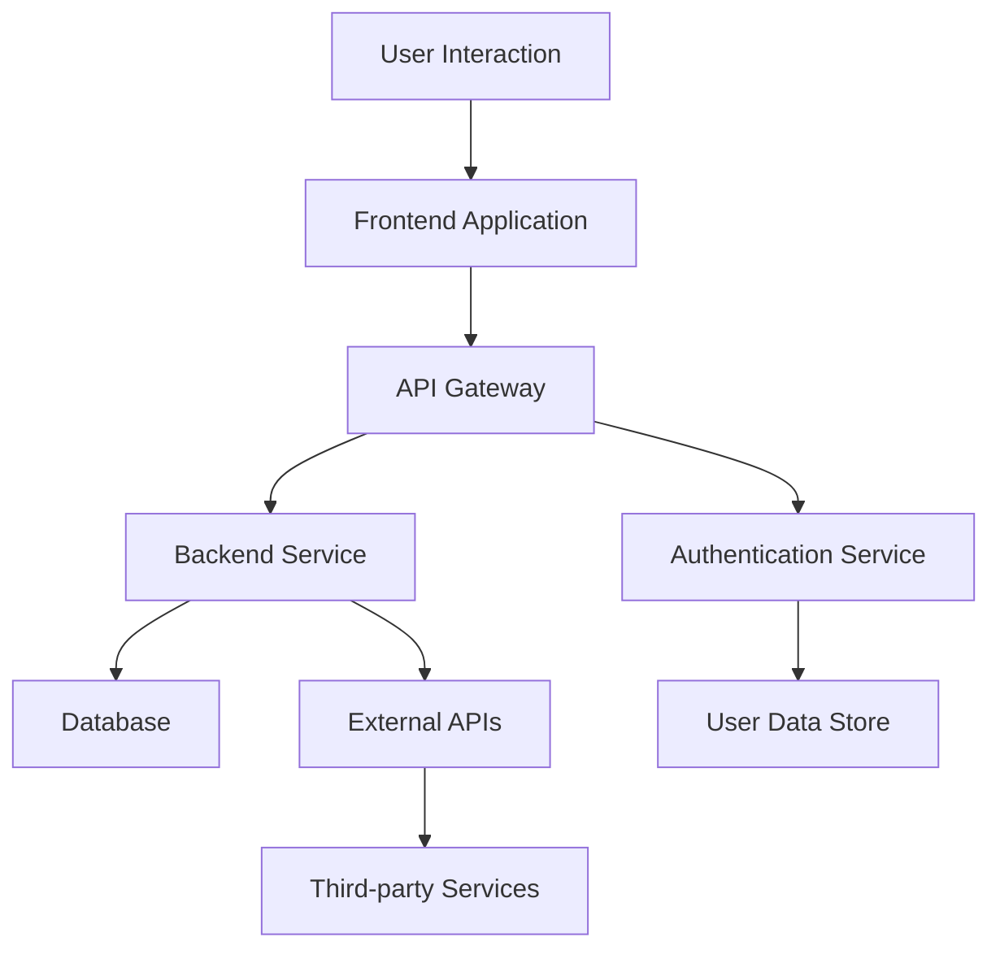

# Architecture Overview

This document provides an overview of the system architecture used within the `jasonbender-c3x/app` repository.

## Components

1. **User Interaction:** Encompasses the interface where the user directly interacts with the application.
2. **Frontend Application:** Handles user requests and presents data.
3. **API Gateway:** Manages API requests and ensures secure communication.
4. **Backend Service:** Contains the core business logic of the app.
5. **Database:** Stores persistent data such as user information, logs, and more.
6. **External APIs:** Helps integrate third-party data and services.
7. **Third-party Services:** Used for features not directly built in the app.
8. **Authentication Service:** Handles user authentication to ensure secure access.
9. **User Data Store:** Maintains user data securely for authentication purposes.

This diagram illustrates high-level communication and interaction between components.
